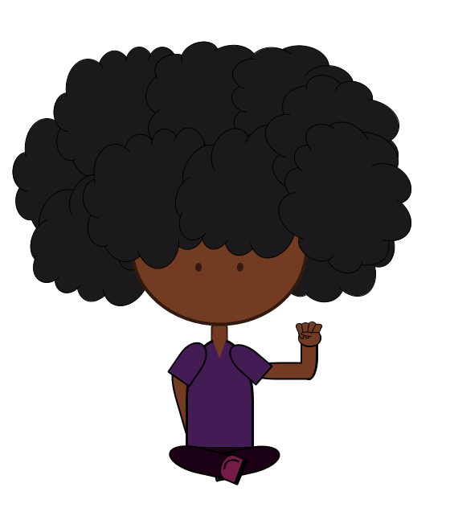
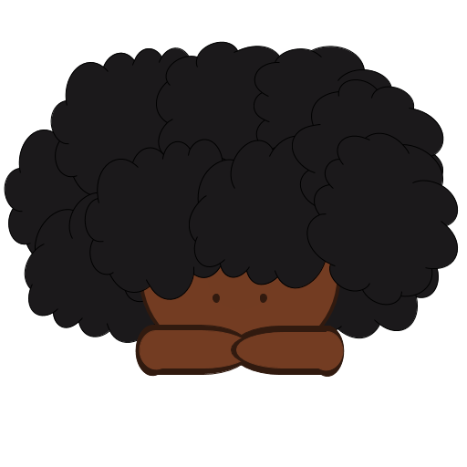

# Part 3: graphics

## graphics for the non-graphic designer
If you can afford a graphic designer, make the investment. However, if you have a few hours to spare and are willing to style your pages to compensate for simple graphics, look no further! We are going to combine free stock photos as well as drawings made in any shape + paint editor (I'm using Google Drawings)

How I typically plan my graphics is to think about the aesthetic I want for my site. I need a big picture for my banner, another picture for my about, and 3 pictures for my projects section.

You can easily design cartoon personas from the inspiration of [a quick google search](https://www.google.com/search?q=cartoon+characters+simple). I always think about the character that I want to create and design a few scenarios around that. Additionally, there are a few good completely free stock photo sites for cool abstract pictures. These are some images I found and came up with:

The video explanation of this tutorial contains a time-lapse of how i masde these graphics, but if you can find photos of what you want that fit your theme without creating things, thats also cool. I also use one of the graphics as my favicon, which combines some work.

There are other more powerful tools for graphics, such as [GIMP](https://www.gimp.org/), which is a free image manipulation tool with features (in my opinion) as powerful as photoshop. For video splash backgrounds, there are other  tools like [DaVinci](https://www.blackmagicdesign.com/products/davinciresolve/), which have free and paid versions which are both poweful. For the free version, I find that the fusion editor gives me the most capabilities.

## stock photos

Sock photos are also a great way to add ot the aesthetic of the website. I use [Pexels](https://www.pexels.com/) because you can use anything and download without creating an account. However the variety is a bit limited for niche topics, but its great for abstract/aesthetic backgrounds. All of the backgrounds in teh about section are from pexels.

alright... [lets style this now D:](4.Styling.md)
