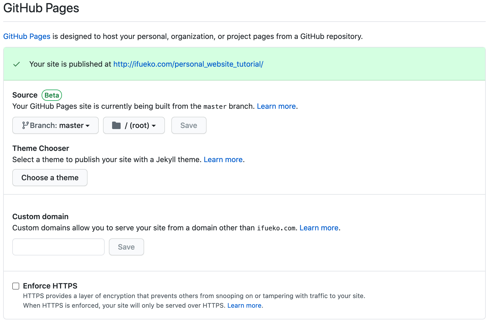

# Part 6: publishing to GitHub Pages

This is extremly simple. To publish to github pages, you can just go to your repo's settings in github and choose a source folder to publish from.

Thats also where you put the name of your custom domain, as well as choose to enforce HTTPS with a free github provided SSL certificate.

But for this custom domain to work, [you need to set up your site's DNS...](7.Custom_Domains_SSL.md)
