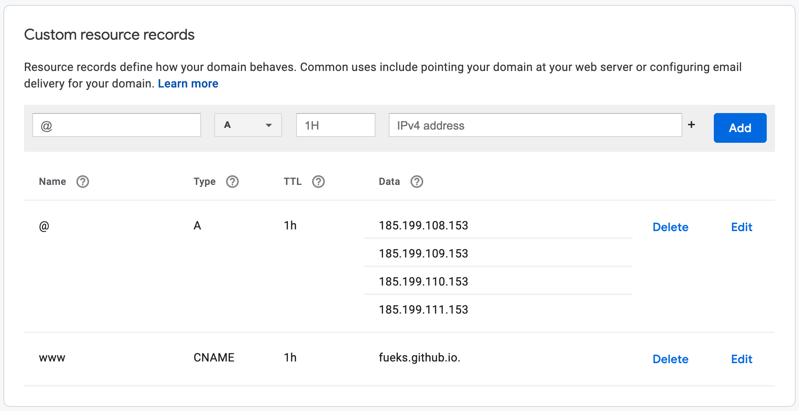
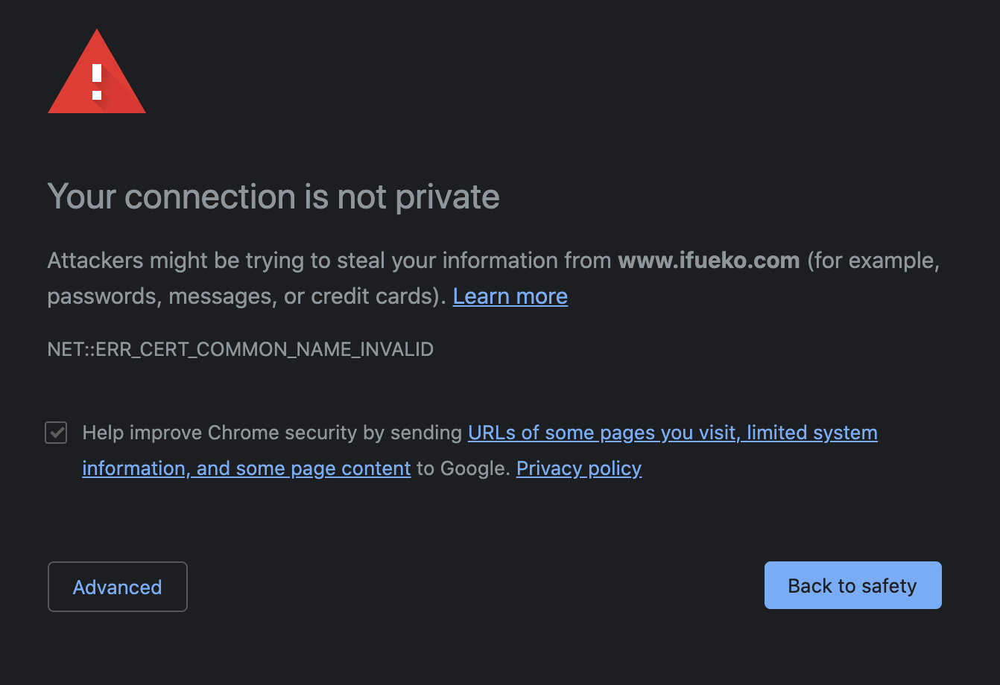

# Part 7: custom domain configuration

The last thing you need to do is add two sets of records to your domain's DNS configuration. The first are the A records, which point to the IP address of GitHub's servers. The up-to-date locations can typically be found on [GitHub's documentation on this topic](https://docs.github.com/en/github/working-with-github-pages/managing-a-custom-domain-for-your-github-pages-site), so I wont actually put the numbers here, but here is an example of what it should look like (This is from the DNS tab in the google domains dashboard):

Lastly you need to ad a www / CNAME record, which points to the name of the website that will be served from your custom domain. this will typically be [*your_username*.github.io](#), but github will tell you in that settings page what your website is.

### SSL Caveat with Custom Domains

The one thing we need to understand about GitHub's free SSL certificate is that it is still owned by github, and thus it will sometimes show up as not secure. This can be seen when navigating to any github pages + custom domain site using https://www:

Thers no way of getting around this. This is not something that can be solved easily with github pages, and there are also other sites that mentionn this issue and provide some workarounds. However, most people don't type in https://www before their websites, so many people never notice this.

## And thats it!
Hope this was helpful! :)
Check out the completed website [here](http://www.ifueko.com/personal_website_tutorial/full_website)
